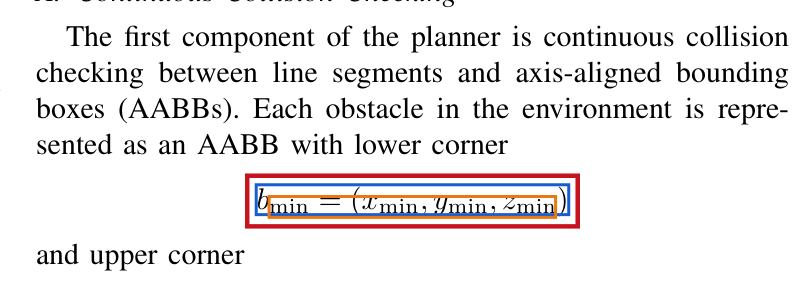

# Enterprise Document MCP Knowledge Base

A local PDF/PPTX ingestion pipeline and MCP server for searchable,
source-grounded document retrieval. The project focuses on the difficult parts
of enterprise document handling: page geometry, multi-column reading order,
tables, broken PDF math glyphs, and verifiable reconstruction.

## Current Capabilities

| Capability | Implementation | Output |
| --- | --- | --- |
| PDF extraction | `pdfplumber` text, word geometry, tables, page bboxes | `output/extracted_blocks.json` |
| PPTX extraction | `python-pptx` shapes, slide locations, notes | `output/extracted_blocks.json` |
| Structured chunking | Section-aware blocks, bbox and source metadata | `output/cleaned_chunks.json` |
| Local retrieval | Persistent `HashingVectorizer` index with metadata lookup | `output/vector_index/` |
| MCP access | FastMCP tools/resources over stdio or Streamable HTTP | local server and public Render endpoint |
| Math recovery | Geometry detection, optional OCR/LLM transcription, bbox merge | equation JSON and corrected chunks |
| Extraction audit | Reconstruct chunks at original page positions | reconstructed PDF |

The local retrieval index is intentionally dependency-light and reproducible.
It is not a neural embedding or reranking system yet.

## Repository Policy

Documents and generated results are local artifacts. The repository ignores:

- `.env` and local MCP/client configuration
- `data/raw/*` source documents
- `data/processed/*` generated normalized data
- `output/*` crops, indexes, reports, and reconstructed PDFs
- `server_logs/*` local MCP logs

Placeholder `.gitkeep` files preserve the expected directory layout. Never
commit confidential source documents or API keys.

## 1. Install

Requirements:

- Python 3.11 or newer
- Tesseract only if running the optional OCR math diagnostic
- An OpenAI API key only if running the optional vision-based math
  transcription step

```bash
git clone https://github.com/tsaiton123/Enterprise_Doc_MCP.git
cd Enterprise_Doc_MCP

python3 -m venv .venv
.venv/bin/pip install -e ".[dev]"

# macOS, optional for equation OCR
brew install tesseract
```

For LLM-assisted equation transcription:

```bash
cp .env.example .env
# Edit .env locally and set OPENAI_API_KEY.
```

## 2. Add Local Documents

Copy PDF or PPTX files into `data/raw/`. The pipeline processes only files
already present there; it does not generate sample documents.

```text
data/raw/
  report.pdf
  strategy_deck.pptx
```

## 3. Run Baseline Extraction And Indexing

```bash
.venv/bin/python pipeline/run_pipeline.py
```

Generated artifacts:

| File | Meaning |
| --- | --- |
| `output/extracted_blocks.json` | Layout-level blocks: paragraphs, headings, equations, captions, tables |
| `output/cleaned_chunks.json` | Retrieval units with page/slide, section, bbox, reading order, and neighbor metadata |
| `output/vector_index/` | Local persistent retrieval index |
| `output/pipeline_report.json` | Block/chunk totals and diagnostics |
| `output/extraction_quality_report.json` | Bbox coverage and suspicious extraction indicators |
| `output/retrieval_results.json` | Example retrieval query results |

A chunk remains traceable to its source location:

```json
{
  "chunk_id": "report_p1_19_equation",
  "text": "b_min = (x_min, y_min, z_min)",
  "content_type": "equation",
  "source_file": "report.pdf",
  "page": 1,
  "bbox": {
    "x0": 382.42,
    "top": 263.59,
    "x1": 492.59,
    "bottom": 280.47
  },
  "metadata": {
    "latex": "b_{\\min} = (x_{\\min}, y_{\\min}, z_{\\min})",
    "extraction_method": "pdfplumber_bbox_merge_with_llm_transcription"
  }
}
```

## 4. Recover Equations When PDF Text Is Broken

This step is optional. Baseline extraction is sufficient for ordinary prose;
use the math workflow when PDF glyph extraction separates scripts, symbols, or
equation fragments into incorrect text boxes.

### The Problem

Some PDFs store a displayed equation as several positioned glyph streams. For
example, `pdfplumber` may extract a base formula and its subscript as separate
lines:

```text
b = (x , y , z )
min min min min
```

The source page looks correct visually, but naive chunking produces duplicate
or corrupted text.



In the crop above, blue outlines the base equation line, orange outlines the
detached script glyphs, and red outlines the merged region submitted for math
transcription.

### The Implemented Approach

1. `pdfplumber` provides geometry only: word/line boxes and reading order.
2. `pipeline/equation_regions.py` detects math seed lines and nearby
   superscript/subscript fragments, then unions them into one candidate bbox.
3. Optional Tesseract OCR provides a cheap diagnostic transcription.
4. Optional OpenAI vision transcription converts the crop into normalized
   LaTeX and plain text.
5. `pipeline/merge_equations.py` replaces the original equation components
   with one corrected equation block.
6. Lines consumed by the equation, such as `min min min min`, are removed from
   neighboring paragraph blocks before final chunks are written.

### Commands

Use the actual PDF filename from `data/raw/`:

```bash
# Visualize candidate equation bboxes on a copy of the PDF.
.venv/bin/python client/mark_equation_bboxes.py report.pdf

# Optional local OCR diagnostic. This also creates the equation crops.
.venv/bin/python client/ocr_equation_regions.py report.pdf

# Vision transcription. Requires OPENAI_API_KEY in .env.
.venv/bin/python client/llm_equation_regions.py \
  --regions-json output/report_equation_ocr.json \
  --output-json output/report_equation_llm.json \
  --limit 0

# Regenerate final blocks, chunks, and index with merged math.
.venv/bin/python pipeline/run_pipeline.py \
  --equations-json output/report_equation_llm.json
```

Final `extracted_blocks.json` and `cleaned_chunks.json` contain the merged
equation and retained neighboring prose, but not the consumed ghost text
boxes. The intermediate equation JSON intentionally keeps raw component bboxes
for auditability.

### Conservative Handling Of Inline Math

Displayed equations are safe to replace when their merged regions are
well-bounded. Inline equations are more dangerous: a partial inline candidate
can overlap ordinary prose, and replacing it may erase part of a sentence.

The reconstruction step therefore:

- replaces reviewed single-line display equations by default
- skips inline equation overlays unless `--include-inline` is explicitly set
- skips display regions taller than the configured safety threshold
- reports skipped regions for later review

This preserves document integrity while exposing unresolved extraction cases.

## 5. Validate Extraction Through Reconstruction

Reconstruction is a layout audit. It draws cleaned chunks onto blank PDF pages
using their extracted bboxes, so missing headings, mixed columns, overlaps, and
damaged equation extraction are visible.

```bash
# Reconstruct only from cleaned chunks and recorded positions.
.venv/bin/python client/reconstruct_pdf.py report.pdf \
  --output output/reconstructed_report.pdf

# Overlay safe LLM-transcribed display equations on the reconstructed PDF.
.venv/bin/python client/reconstruct_math_pdf.py report.pdf \
  --base-pdf output/reconstructed_report.pdf \
  --equations-json output/report_equation_llm.json \
  --output-pdf output/reconstructed_report_with_llm_math.pdf \
  --report-json output/reconstructed_report_with_llm_math_report.json
```

This is not intended to reproduce font styling perfectly. It tests whether the
extraction pipeline retained content type, reading order, and location.

## 6. Bottlenecks And Mitigations

| Bottleneck | Failure Mode | Current Mitigation | Remaining Work |
| --- | --- | --- | --- |
| Multi-column PDFs | Lines from opposite columns interleave in chunks | Page geometry detects left/right columns and orders each separately | Handle complex three-column layouts and floating figures |
| Displayed math | Subscripts/superscripts appear as detached duplicate text | Candidate bbox union, optional LLM LaTeX, component consumption in final JSON | Improve recognition without an external model |
| Inline math | Candidate bbox overlaps surrounding sentence text | Detect candidates but skip reconstruction replacement by default | Context-aware inline span segmentation |
| Tables | Text extraction loses row relationships | `pdfplumber` table extraction and Markdown preservation | Stitch tables continued across pages |
| Reconstruction | A cleaned text dump can hide location errors | Blank-page bbox reconstruction plus optional math overlays | Automated visual similarity scoring |
| Retrieval quality | Local hashed lexical vectors are limited for paraphrases | Traceable baseline with source citations | Add configurable neural embeddings and reranking |

## 7. Run The MCP Server Locally

Run extraction before starting MCP, because tools read
`output/cleaned_chunks.json` and `output/vector_index/`.

### Local Client: Stdio

For local use, remote hosting is not required. Configure your MCP client to
spawn this server over stdio:

```json
{
  "mcpServers": {
    "enterprise-doc-kb": {
      "command": "/absolute/path/to/Enterprise_Doc_MCP/.venv/bin/python",
      "args": ["-m", "mcp_server.server"],
      "cwd": "/absolute/path/to/Enterprise_Doc_MCP"
    }
  }
}
```

Restart the client after changing its MCP configuration.

### Local HTTP Development: Streamable HTTP

Use Streamable HTTP locally when developing a remote-client integration:

```bash
MCP_TRANSPORT=http MCP_HOST=127.0.0.1 MCP_PORT=8000 \
  .venv/bin/python -m mcp_server.server
```

The Streamable HTTP MCP endpoint is `http://127.0.0.1:8000/mcp`.

## 8. Remote MCP Evaluation

The submitted remote MCP server is live at:

```text
https://enterprise-doc-mcp.onrender.com/mcp
```

The hosted knowledge base indexes only self-created demonstration inputs:
`enterprise_report.pdf` and `strategy_deck.pptx`. It does not receive or
process a reviewer's local documents. The service may take longer to answer its
first request after an idle period because it is hosted on a free web-service
tier.

### Verify The Public MCP Endpoint

From a local clone with dependencies installed:

```bash
.venv/bin/python client/test_remote.py \
  https://enterprise-doc-mcp.onrender.com/mcp
```

The smoke client lists MCP tools and calls `answer_with_citations` against the
synthetic indexed report. An expected demo question is:

```text
What was APAC revenue growth?
```

Expected grounded content: APAC revenue of `$2.1M` with `12%` growth, cited
from `enterprise_report.pdf`.

To evaluate through Claude Code:

```bash
claude mcp add --transport http enterprise-doc-kb \
  https://enterprise-doc-mcp.onrender.com/mcp
```

Then ask:

```text
Use enterprise-doc-kb to answer: What was APAC revenue growth?
```

## 9. MCP Tools And Resources

Tools:

| Tool | Purpose |
| --- | --- |
| `search_knowledge_base(query, top_k, source_filter)` | Retrieve ranked chunks |
| `answer_with_citations(query, top_k, source_filter)` | Return grounded snippets with page/slide citations |
| `get_chunk(chunk_id)` | Inspect an individual retrieval unit and bbox |
| `get_chunks_by_page(source_file, page)` | Recover a page in reading order |
| `list_documents()` | List indexed sources and sections |
| `get_document_outline(doc_id)` | Map sections to chunks |
| `get_table(table_id)` | Retrieve a table chunk |

Resources:

```text
resource://documents
resource://documents/{doc_id}/outline
resource://documents/{source_file}/pages/{page}
resource://chunks/{chunk_id}
resource://tables/{table_id}
```

Example requests through an MCP client:

```text
Use enterprise-doc-kb to summarize the technical approach with citations.
Use enterprise-doc-kb to retrieve all chunks on page 3.
Use enterprise-doc-kb to find the table discussing runtime.
```

## 10. Test

With at least one local PDF or PPTX in `data/raw/` and a generated index:

```bash
.venv/bin/python client/test_client.py
.venv/bin/pytest
```

The equation merge regression test specifically verifies that detached
subscript text is consumed by a merged equation while adjacent prose is
preserved.

## AI / Agent Workflow

This project was developed through an AI coding-agent workflow using Codex and
Claude Code for implementation and verification:

- designed the document normalization, metadata-rich chunking, retrieval, and
  FastMCP tool surface through iterative agent-assisted code changes
- diagnosed PDF geometry failures by reconstructing extracted chunks at their
  original bboxes and visually inspecting equation overlays
- implemented and tested conservative equation-region merging, optional OCR,
  and optional OpenAI vision transcription for broken mathematical text
- packaged the MCP server for Streamable HTTP deployment, deployed it to
  Render, and verified a live `answer_with_citations` call against the public
  endpoint

The Git history preserves these stages as separate commits: initial pipeline,
extraction/math documentation, public MCP container deployment, and Render
Blueprint deployment.

## Project Structure

```text
data/raw/                  local input PDF and PPTX files, ignored by Git
data/processed/            generated intermediate JSON, ignored by Git
pipeline/                  extraction, chunking, math merging, indexing
mcp_server/                FastMCP tools and resources
client/                    diagnostics, OCR/LLM math passes, reconstruction
deploy/                    public HTTP deployment bootstrap
render.yaml                free public demo Blueprint configuration
docs/assets/               non-sensitive README illustrations
tests/                     retrieval, MCP, and equation-merge tests
output/                    generated reports/index/PDF reconstructions, ignored
server_logs/               optional local MCP verification logs, ignored
```
